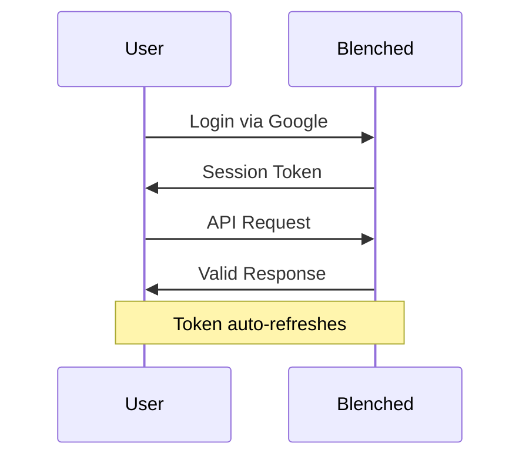

## Overview

Blenched provides essential tools for secure user authentication and account management. You access core services through a streamlined Google sign-in interface, ensuring quick and reliable logins. This guide covers key features like account management, secure session handling, and profile customization to help you maximize platform efficiency.

<Callout kind="info">
  All features integrate seamlessly with Google OAuth for enhanced security and user convenience.
</Callout>

## Key Features

Discover Blenched's standout capabilities through these core features.

<Columns cols={3}>
  <Card title="Account Management" icon="users" href="#account-management">
    Create, update, and monitor user accounts with intuitive tools.
  </Card>
  <Card title="Secure Sessions" icon="shield" href="#secure-sessions">
    Maintain safe, persistent sessions across devices.
  </Card>
  <Card title="Profile Customization" icon="user" href="#profile-customization">
    Personalize your experience with flexible profile options.
  </Card>
</Columns>

## Account Management Tools

Manage user accounts effortlessly with Blenched's dedicated tools. You can view account details, update information, and handle permissions directly from the dashboard.

<Steps>
  <Step title="Access Dashboard" icon="monitor">
    Log in via Google sign-in at `https://dashboard.example.com`.
  </Step>
  <Step title="View Accounts" icon="list">
    Navigate to the Accounts section to list all active users.
  </Step>
  <Step title="Edit Details" icon="edit">
    Select an account and modify fields like email or role.
  </Step>
</Steps>

<CodeGroup tabs="JavaScript,Python">
  ```javascript
  // Fetch account list
  const response = await fetch('https://api.example.com/v1/accounts', {
    headers: { Authorization: `Bearer ${YOUR_TOKEN}` }
  });
  const accounts = await response.json();
  console.log(accounts);
  ```
  ```python
  import requests
  response = requests.get(
    'https://api.example.com/v1/accounts',
    headers={'Authorization': f'Bearer {YOUR_TOKEN}'}
  )
  accounts = response.json()
  print(accounts)
  ```
</CodeGroup>

## Secure Session Handling

Blenched ensures your sessions remain protected with automatic token refresh and logout detection. Sessions expire after inactivity, preventing unauthorized access.



<Callout kind="tip">
  Always validate session tokens on the client side before API calls to avoid errors.
</Callout>

## User Profile Customization

Tailor your profile to fit your needs. Choose themes, set preferences, and upload avatars through simple forms.

<Tabs>
  <Tab title="Web" icon="globe">
    Update your profile via the dashboard settings.

    ```javascript
    await fetch('https://api.example.com/v1/profile', {
      method: 'PATCH',
      headers: { 'Content-Type': 'application/json', Authorization: `Bearer ${YOUR_TOKEN}` },
      body: JSON.stringify({ theme: 'dark', avatar: 'url-to-image' })
    });
    ```
  </Tab>
  <Tab title="Mobile SDK" icon="smartphone">
    Use the Blenched mobile SDK for native integration.

    ```javascript
    BlenchedSDK.updateProfile({
      theme: 'light',
      notifications: true
    });
    ```
  </Tab>
</Tabs>

## Basic Feature Walkthrough

Follow this walkthrough to explore Blenched features end-to-end.

<ExpandableGroup>
  <Expandable title="Step 1: Initial Setup" default-open="true">
    Sign in and configure your first account.
  </Expandable>
  <Expandable title="Step 2: Customize Profile">
    Adjust settings for personalized use.
  </Expandable>
  <Expandable title="Step 3: Test Sessions">
    Verify secure handling across sessions.
  </Expandable>
</ExpandableGroup>

| Feature | Benefit | API Endpoint |
|---------|---------|--------------|
| Account Management | Centralized control | `/v1/accounts` |
| Secure Sessions | Auto-refresh tokens | `/v1/sessions` |
| Profile Customization | User preferences | `/v1/profile` |

<Callout kind="success">
  Ready to implement? Start with the [Quickstart](/quickstart) guide for hands-on setup.
</Callout>